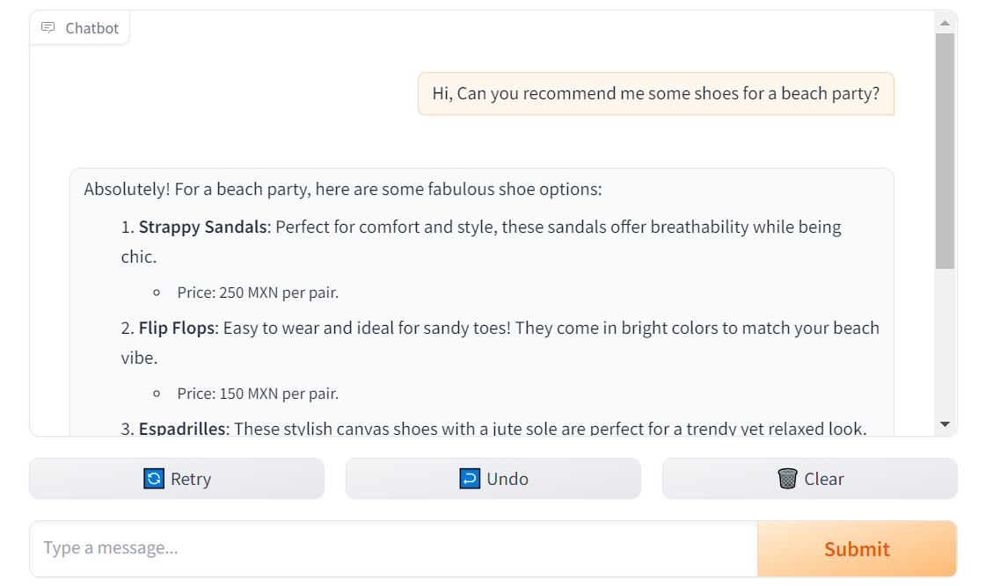
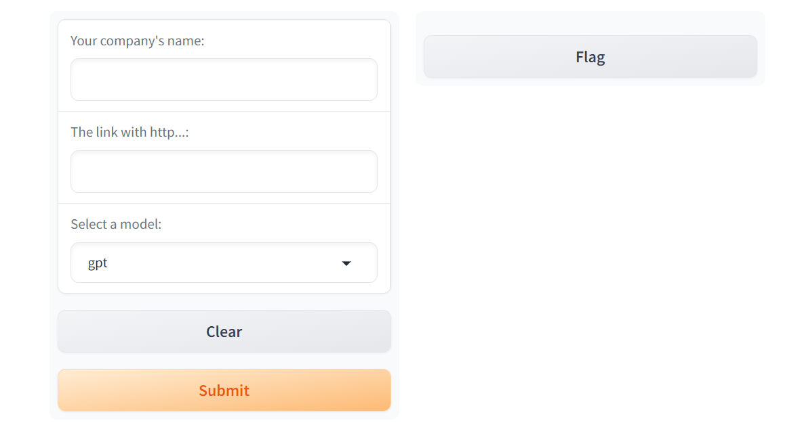
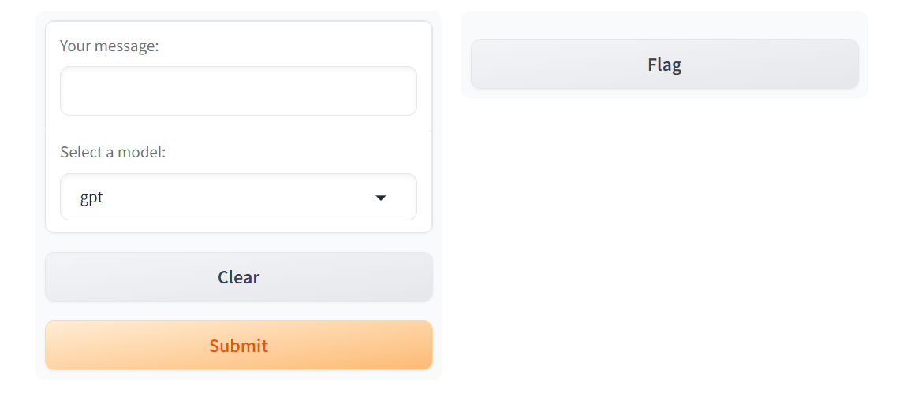

# LLM Applications Showcase
This repository showcases a collection of interactive applications powered by multiple large language models (LLMs), including **GPT (OpenAI), Claude (Anthropic), Gemini (Google), and Ollama (Meta)**. The project highlights a variety of innovative tools such as:

- **Multi-Model Response System**: Integrates multiple models for well-rounded responses.
- **Real-Time Streaming Interface**: Uses Gradio to offer live interactions with LLMs.
- **Web Scraping Tools**: Extracts content from websites to generate useful outputs like brochures.
- **Sales Chatbot**: Provides automated customer support for an online footwear store, powered by a product catalog.

By combining web scraping and Gradio interfaces, this project demonstrates the flexibility of LLMs in various practical applications, from generating dynamic content to real-time customer engagement.

## ⚙️ Requirements

To set up this project, follow the instructions below.

### 1. Install Libraries using `requirements.txt`

To install the necessary libraries, simply run the following command in your terminal:

```bash
pip install -r requirements.txt
```
This will install all the required libraries listed in the requirements.txt file.

### 2. Set Up Your .env File
You'll need to create a .env file to store your API keys. The file should have the following structure:
```bash
OPENAI_API_KEY=sk......
ANTHROPIC_API_KEY=sk......
GOOGLE_API_KEY=.....
```
Replace sk...... and ..... with your actual API keys.
The .env file should be stored in the root directory of the project.
### 3. Install Ollama Locally
To install Ollama locally, follow these steps:

- Download the Ollama software from the official website: Ollama.
- Follow the installation instructions based on your operating system.

### 4. .gitignore Configuration
To ensure that sensitive files like your .env are not uploaded to GitHub, create a .gitignore file in your project’s root directory and add the following line:
```bash
.env
```
This ensures that the .env file is excluded from version control, keeping your API keys secure.

## 💬1. Sales Chatbot Powered by Store Catalog
This project implements a sales chatbot supported by a product catalog from a footwear store. It uses natural language processing (NLP) techniques and an OpenAI model to provide dynamic responses to customers, helping them find the perfect products based on their queries. The system also handles responses for unavailable products, offering alternatives that better fit the customer's needs.

### Key Features
The Sales Chatbot Powered by Store Catalog is an automated solution for interacting with customers of an online footwear store. It uses a model trained with examples of successful conversations and examples of handling unavailable products. The chatbot accesses a product catalog to provide details on items, prices, and alternatives, enhancing the customer experience.

- Real-time interaction: The chatbot processes user messages and responds dynamically.
- Product catalog: The system queries a product catalog to provide detailed information about footwear, such as prices and features.
- Unavailable product handling: If a customer inquires about a product not in the catalog, the chatbot offers friendly responses and suggests available alternatives.
- Sales optimization: The chatbot is designed to present products in an attractive and effective way, promoting the sale of available items.



## 📣2. Web Scraping & Language Model Brochure Generator with Gradio
This project is a **web scraping tool** that fetches content from a company’s website and generates a **brochure** using various language models such as GPT, Claude, Gemini, and Ollama. The output is presented in a **Gradio interface** for easy user interaction. The generated brochure is provided in Markdown format, summarizing key aspects of the company, including its culture, customers, careers, and available courses/packages.

### Key Features

- **Web Scraping:** Extracts content from a specified company website.
- **Multi-Model Support:** Uses various language models (GPT, Claude, Gemini, Ollama) to generate a brochure based on scraped content.
- **Markdown Output:** The generated brochure is outputted in Markdown format.
- **Gradio Interface:** A simple user interface to interact with the tool and select the preferred language model.



## 🖥️💻 3. Multi-Model Streaming Response Interface
This project enables interaction with multiple language models (**OpenAI GPT, Claude, Gemini, and Ollama**) through a real-time streaming interface (**Gradio**). The user can input a prompt and select one of the available models to generate a response in a friendly tone.

### Key Features
- Real-time streaming responses: All models return responses as they are generated, allowing for a smoother user experience.
- Multiple model support: Choose between four powerful language models: OpenAI GPT, Claude, Gemini, and Ollama.
- Friendly system prompt: All responses are framed with a friendly tone to make interactions more engaging.
- Gradio interface: A user-friendly web interface powered by Gradio to interact with the models.


## 🤖💬4. Multi-Model Response System
This repository presents a **multi-model response system** that integrates four different language models (**GPT, Claude, Gemini, and Ollama**) to generate responses based on a given system prompt. The responses from each model are combined to provide a well-rounded answer, utilizing the strengths of each individual model.

### Key Features
The system gathers conversations from different LLMs (Large Language Models), specifically GPT, Claude, Gemini, and Ollama. Each model has a tailored system prompt to define the assistant's tone and behavior. These models generate responses based on the input system prompt and subsequent exchanges from each model, simulating a conversation with varying perspectives.

- Multi-Model Integration: The system collects responses from GPT, Claude, Gemini, and Ollama, each offering distinct perspectives based on their predefined behavior prompts.
- Custom System Prompts: Each model has a custom system prompt designed to direct the tone and style of the assistant's response, ensuring a balanced and diverse conversation.
- Conversation Continuity: The system updates the conversation by appending responses from each model, ensuring a continuous and evolving discussion.


Notes
-----
Some Exercises Completed for the LLM Course at Frogames

License
-------


This project is licensed under the MIT License - see the [LICENSE](./LICENSE) file for details.